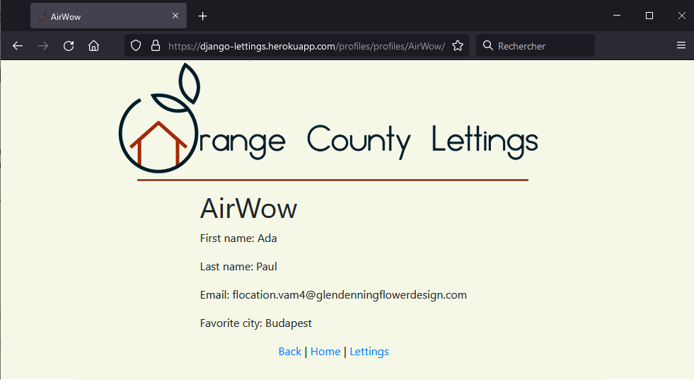

## Résumé

Site web d'Orange County Lettings




## Développement local

### Prérequis

- Compte GitHub avec accès en lecture à ce repository
- Git CLI
- SQLite3 CLI
- Interpréteur Python, version 3.6 ou supérieure

Dans le reste de la documentation sur le développement local, il est supposé que la commande `python` de votre OS shell exécute l'interpréteur Python ci-dessus (à moins qu'un environnement virtuel ne soit activé).

### macOS / Linux

#### Cloner le repository

- `cd /path/to/put/project/in`
- `git clone https://github.com/OpenClassrooms-Student-Center/Python-OC-Lettings-FR.git`

#### Créer l'environnement virtuel

- `cd /path/to/Python-OC-Lettings-FR`
- `python -m venv venv`
- `apt-get install python3-venv` (Si l'étape précédente comporte des erreurs avec un paquet non trouvé sur Ubuntu)
- Activer l'environnement `source venv/bin/activate`
- Confirmer que la commande `python` exécute l'interpréteur Python dans l'environnement virtuel
`which python`
- Confirmer que la version de l'interpréteur Python est la version 3.6 ou supérieure `python --version`
- Confirmer que la commande `pip` exécute l'exécutable pip dans l'environnement virtuel, `which pip`
- Pour désactiver l'environnement, `deactivate`

#### Exécuter le site

- `cd /path/to/Python-OC-Lettings-FR`
- `source venv/bin/activate`
- `pip install --requirement requirements.txt`
- `python manage.py runserver`
- Aller sur `http://localhost:8000` dans un navigateur.
- Confirmer que le site fonctionne et qu'il est possible de naviguer (vous devriez voir plusieurs profils et locations).

#### Linting

- `cd /path/to/Python-OC-Lettings-FR`
- `source venv/bin/activate`
- `flake8`

#### Tests unitaires

- `cd /path/to/Python-OC-Lettings-FR`
- `source venv/bin/activate`
- `pytest`

#### Base de données

- `cd /path/to/Python-OC-Lettings-FR`
- Ouvrir une session shell `sqlite3`
- Se connecter à la base de données `.open oc-lettings-site.sqlite3`
- Afficher les tables dans la base de données `.tables`
- Afficher les colonnes dans le tableau des profils, `pragma table_info(Python-OC-Lettings-FR_profile);`
- Lancer une requête sur la table des profils, `select user_id, favorite_city from
  Python-OC-Lettings-FR_profile where favorite_city like 'B%';`
- `.quit` pour quitter

#### Panel d'administration

- Aller sur `http://localhost:8000/admin`
- Connectez-vous avec l'utilisateur `admin`, mot de passe `Abc1234!`

### Windows

Utilisation de PowerShell, comme ci-dessus sauf :

- Pour activer l'environnement virtuel, `.\venv\Scripts\Activate.ps1` 
- Remplacer `which <my-command>` par `(Get-Command <my-command>).Path`

## Déploiement

### Fonctionnement du déploiement

Utilisation de pipeline avec CircleCi pour : 
- Remonté automatique du projet à chaque mise à jour Git Hub
- L'analyse des tests, 
- Déploiement en ligne de l'application par Heroku 
- Sauvegarde/gestion d'image en ligne par Docker Hub
- Suivis des erreurs et performances par Sentry

### Configuration requise

Création de Compte requise pour: 
- Git Hub
- Circleci 
- Docker Hub
- Heroku
- Sentry

Installer le client Docker :  
https://docs.docker.com/engine/install  

Installer le client Heroku :  
https://devcenter.heroku.com/articles/heroku-cli  

### Etape 1 : Mise en place de Circle CI

Liaison du projet à Circle CI:  
- Connectez vous.  
- Verifiez que votre compte Circle Ci est bien relié votre compte GitHub  
- Allez dans `Projets`  
- Cliquez sur `Set Up Project`  
- Choisissez votre projet GitHub  
- Retournez ensuite sur la `Dash Board`  

Création de variable d'environnement  
- Dans `All Project` Selectionnez votre projet  
- Cliquez sur `Project Settings`  
- Cliquez sur `Environment Variables`  
- Cliquez sur `Add Environment Variables`  

|   Nom des Variable à ajouter  |   Description   |   Exemple   |
|---    |---   |---    |
|   DJANGO_SECRET_KEY   |   Clef django   |   `fp$9^593hsriajg$_%=5trot9g!1qa@ew(o-1#@=&4%=hp46(s`   |
|   DJANGO_SETTINGS_MODULE   |   Fichier de settings à utiliser   |   `oc_lettings_site.settings.production`  |
|   HEROKU_TOKEN   |   Token d'identification Heroku   |   `c4cd94da15ea0544802c2cfd5ec4ead324327430`   |
|   HUB_NAME   |   Le nom de votre compte Dockerhub   |   `RomainMorelDocker`   |
|   HUB_PSWD   |   Votre mot de passe ou token Dockerhub   |   `M0t_de_Pa$$e ou 93098a-1cbe-447d-9059-e93b888b433c`   |
|   SENTRY_NAME   |   Token Sentry   |   `https://e6083@o896872.ingest.sentry.io/5841364`   |
|   HEROKU_APP_NAME   |   Nom de votre appli sous heroku   |   `heroku-lettings1`   |

Pour récupérer votre Token Heroku, tapez la commande :  
```heroku auth:token```  

Pour récupérer votre Token Sentry :    
https://sentry.io -> Settings -> Projects -> Client Keys  

Pour récupérer votre Token Docker Hub:
https://hub.docker.com/settings/security -> New access token

### Etape 2 : Mise en place de Docker HUB

Création du dépôt dans docker Hub  
- Cliquer sur `Create Repository`  
- Ecrivez `django-lettings` et validez  

### Etape 3 : Mise en place de Heroku

Création de l'application dans heroku  
- Cliquer sur `New`  
- Cliquer sur `Create new app`  
- Ecrivez par exemple `heroku-lettings1` et validez  

### Etape 4 : Deploiement

Déploiement Effectué à chaque mise à jour du projet git hub.  
`git add <fichier modifié>`  
`git commit -m "<commentaire>"`  
`git push -u origin`  

Rendez vous sur votre compte Circle Ci pour voir les "jobs" de votre pipeline s'activer  
- `build_and_test` monte et effectue les tests du bon fonctionnement de l'appli, via Pytest et Flake8  
- `deply_to_docker_hub` envoie l'image du projet sur docker hub (uniquement si branche master)  
- `deply_to_heroku` envoie le projet sur heroku et le deploie (uniquement si branche master)  

Vous pouvez desormais acceder à votre application en ligne :  
soit en cliquant sur `open app` de l'app de votre compte heroku  
soit avec `https://<nom de l'appli>.herokuapp.com/` dans votre navigateur  

La surveillance de l'application est ensuite gérable par votre compte sentry  
https://sentry.io
Vous pouvez tester sentry en vous rendant à la page :  
`https://<nom de l'appli>.herokuapp.com/sentry-debug`  
vous génèrerez alors un "Issue" (problème) `ZeroDivisionError` dans sentry  

### Etape 5 : Récupération du projet en local

Vous pouvez récuperer l'image de docker hub et le lancer en local en une commande:  
docker run --pull always -p 8000:8000 --name <nom_local> <compte_hub>/<nom_app_hub>:<TAG>  
<nom_local> correspond à un nom de votre choix ex : save_lettings_01_08_21  

<compte_hub> correspond à votre nom de compte ex : romainmoreldocker  
<nom_app_hub> correspond au nom de votre app sur Docker Hub, ici : django-lettings  
<TAG> Le hachage SHA1 du commit git-hub, vous le trouverez dans votre Dépot Docker Hub en cliquant sur `Tags`
